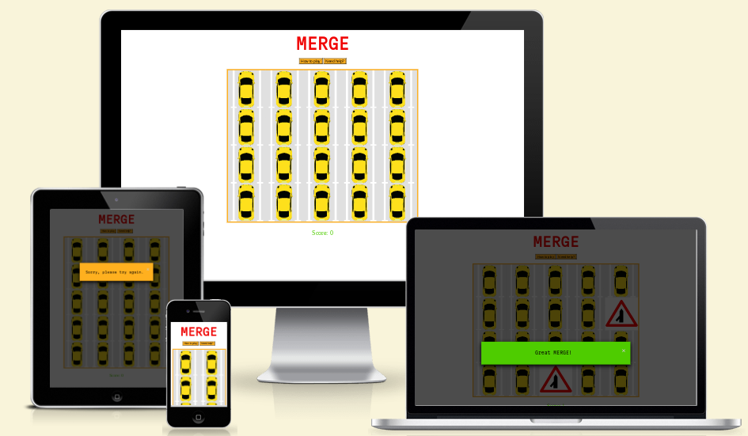
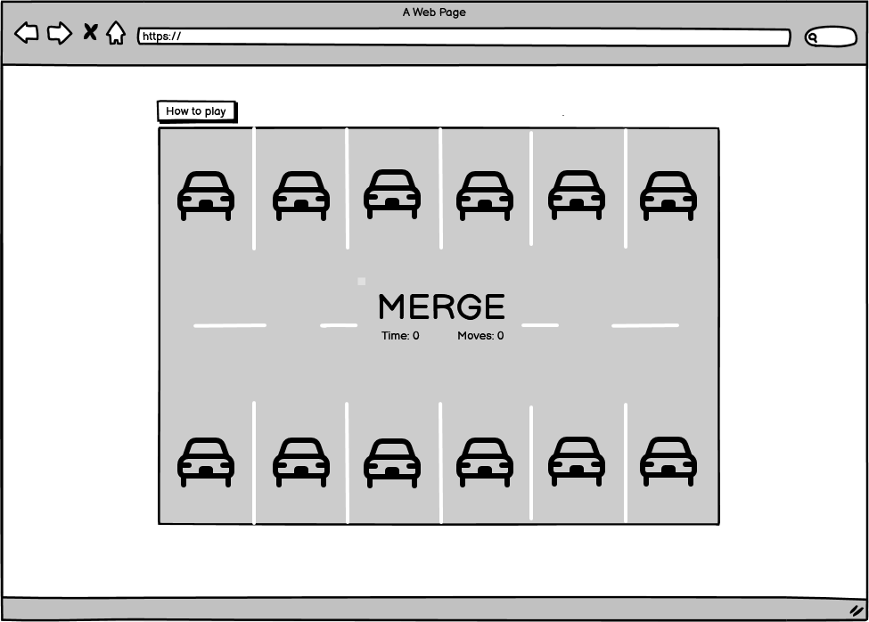

# MERGE

Here is the deployed version of [MERGE](<https://mipear.github.io/Merge/>)

## UX

MERGE is an educational game that hopes to educate learner drivers of UK Road Signs in a fun, purposeful way. MERGE is targeted towards learner drivers and is a memory card matching game in which users have to match images of the road signs to their definitions. MERGE will be useful to learner drivers as it will create an addictive, fun space to learn the road signs in order to eventually pass their theory test.

## User Stories

As a UK learner driver:

- I want to understand the meaning of UK road signs
- I want to have fun while learning
- I want to play a road sign game without being distracted
- I want to be referred to further road signs to take my knowledge further

End user goal: to learn the road signs in order to pass my theory test.
End business goal: to create a fun, educational game, and spread awareness of road sign meanings.

Acceptance criteria: The game should have multiple cards which turn over when clicked to reveal road signs or definitions. Players should be able to click on two cards and the computer should reveal whether or not they are a match.

## Scope

### Features

- Title 
- Simple structure and colours to ensure user can focus solely on matching cards, furthering their road sign knowledge
- 'How to play' button that ensures user can play the game with ease
- 'Need help?' button that shows an image of the featured road signs within the game and their definition, taken from the [GOV.uk](<gov.uk>) website. This modal also includes a link to the GOV.uk website and a PDF featuring all of the road signs for the user to further their knowledge.
- The game area includes 20 images of yellow cards. When clicked, these cards are replaced by 10 images of road signs and 10 images of their corresponding definitions. The user must match/merge these cards in order to gain a point. When matched, the cards are replaced by the 'merge' sign.
- 'Sorry, please try again" modal which appear when a user is unsuccessful in finding a match, either through clicking two separate signs/defintiions or clicking the same card twice.
- 'Great merge" modal which apppars when the user is successful in matching the road sign to its definition.
- Score area - this increments score with every match and, when all cards are matched, congratulates the user.
- Favicon - the favicon included is an image of the merge sign, as seen in the game once cards are matched.

### Features left to implement

- Easy, Medium, Hard pages that correlate to the amount of cards on the board.

## Wireframes

### Desktop

### Tablet

### Mobile

## Surface

## Design

### Colour

### Font

### Media

**Favicon**

## Testing

### Validator Testing

### Unfixed Bugs

## Deployment

The game was deployed to GitHub pages. The steps to deploy are as follows:

- Open file repository on github as found [here] (<https://github.com/mipear/Merge>)
- Click “Settings” on the right of the top nav bar
- Click on “Pages” under the “Code and automation” menu
- Under the “Build and deployment” section, switch the Branch from “None” to “Main” and Save
- The live link can be found here: [Live link] (<https://mipear.github.io/Merge/>)
- If you wish the customise the domain for the site, you can do so by typing and saving your new domain under the “Custom domain” section beneath “Build and deployment”.

## Credits

### Content

- The Code Institute course tutorials have been imperative when creating this game. Namely, the [Love Maths Tutorial] (<https://learn.codeinstitute.net/courses/course-v1:CodeInstitute+CPJS_06_20+2020_T1/courseware/8f9b28d4b7664bb59ddf18b8e090671f/87791688b88e46099e3a77f455419aa8/>)
- [Google Fonts's] (<https://fonts.google.com/>) Martian Mono, monospace was used for the title and text of the game.
- I used [Coolors] (<https://coolors.co/palette/fa0707-ffa600-52d600-ffffff-e2e2e2>) to generate a colour palette. My palette is a simple one that includes traffic light colours in keeping with the road theme.
- [Favicon] (<https://favicon.io/favicon-converter/>) was used to create the game's Favicon
- In order to assist in creating this README.md, I used [this] (<https://github.com/Code-Institute-Solutions/readme-template>) template.
- [User Stories Guide] (<https://github.com/awkale/user-story-best-practice/blob/master/README.md>)
- Tutorials!!!!!!

### Media

- The traffic signs and their definitions were taken from [Gov.uk's Highway Code Traffic Signs] (<https://assets.publishing.service.gov.uk/media/58170307ed915d61c5000000/the-highway-code-traffic-signs.pdf>)
- I created the image of the car and the favicon merge sign using [Procreate] (<https://procreate.com/>)
