# MERGE

Here is the deployed version of [MERGE](https://mipear.github.io/Merge/)

## UX

MERGE is an educational game that hopes to educate learner drivers of UK Road Signs in a fun, purposeful way. MERGE is targeted towards learner drivers and is a memory card matching game in which users have to match images of the road signs to their definitions. MERGE will be useful to learner drivers as it will create an addictive, fun space to learn the road signs in order to eventually pass their theory test.

## User Stories

As a UK learner driver:

1. I want to understand the meaning of UK road signs
2. I want to have fun while learning
3. I want to play a road sign game without being distracted
4. I want to be referred to further road signs to take my knowledge further

End user goal: to learn the road signs in order to pass my theory test.
End business goal: to create a fun, educational game, and spread awareness of road sign meanings.

Acceptance criteria: The game should have multiple cards which turn over when clicked to reveal road signs or definitions. Players should be able to click on two cards and the computer should reveal whether or not they are a match.

## Scope

### Features

- Title
- Simple structure and colours to ensure user can focus solely on matching cards, furthering their road sign knowledge
- 'How to play' button that ensures user can play the game with ease
- 'Need help?' button that shows an image of the featured road signs within the game and their definition, taken from the [GOV.uk](gov.uk) website. This modal also includes a link to the GOV.uk website and a PDF featuring all of the road signs for the user to further their knowledge.
- The game area includes 20 images of yellow cards. When clicked, these cards are replaced by 10 images of road signs and 10 images of their corresponding definitions. The user must match/merge these cards in order to gain a point. When matched, the cards are replaced by the 'merge' sign.
- 'Sorry, please try again" modal which appear when a user is unsuccessful in finding a match, either through clicking two separate signs/defintiions or clicking the same card twice.
- 'Great merge" modal which apppars when the user is successful in matching the road sign to its definition.
- Score area - this increments score with every match and, when all cards are matched, congratulates the user.
- Favicon - the favicon included is an image of the merge sign, as seen in the game once cards are matched.

### Features left to implement

- Easy, Medium, Hard pages that correlate to the amount of cards on the board.

## Wireframes

### Desktop

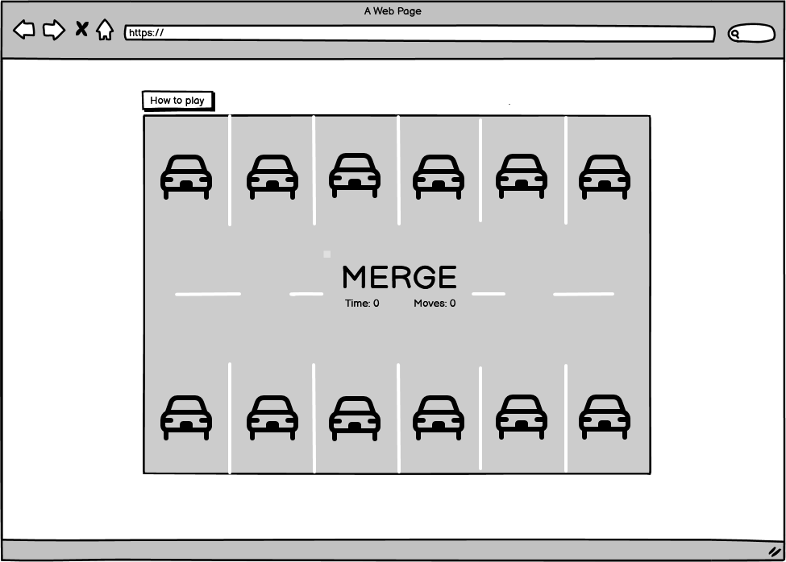

### Tablet

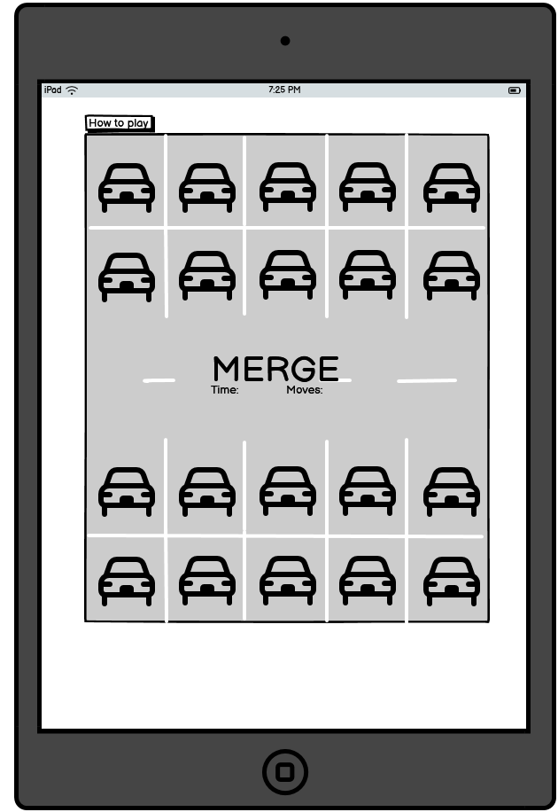

### Mobile

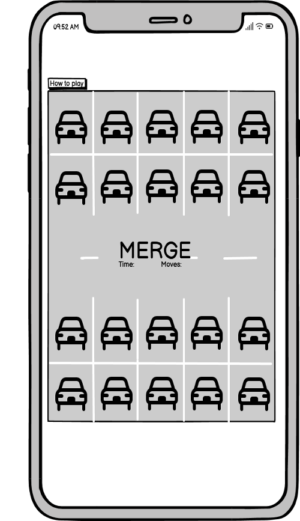

## Design

The game area resembles a car park, with each yellow car representing a card. This creates a little novelty and fun while playing the game, however, as the purpose of MERGE is to educate learner drivers, the design and structure of the page itself is simplistic to ensure there are no distrations when playing the game. The title is clear to read and users can choose to have help both in how to play and in regards to the road signs themselves, should they need this. Below the game includes a score area which indicates the user's matches. Initially, I had included a timer within the game but decided it was not purposeful and did not align with the user's goal of learning the road signs as there is no timer in the real theory test.

### Colour

I used [Coolors](https://coolors.co/) to create the colour palette, as seen below.
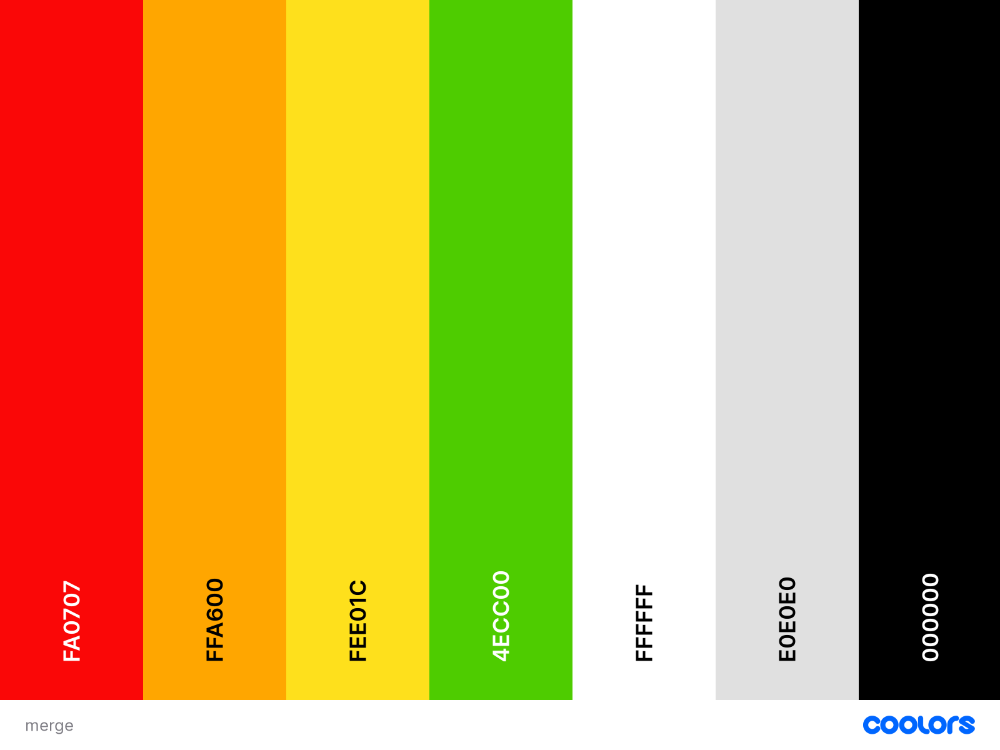

The colours used to section the page -- red, orange, and green -- reflects that of traffic lights, giving a cohesive feel to the page without creating distraction from the user goal of learning. At the top of the page, across devices, I have used red (#FA0707) in the title/header and favicon. Orange (#FFA600) is used within the middle of the page. This is seen on the border of the game area, within the modal buttons, and later in the unsuccessful match modal. The colour orange, here, represents the liminalality the user is currently in; wherein they have not yet passed their theory and are currently in the process of learning. Finally, lime green (#4ECC00) is used both in the score area (eventually saying 'Congratulations!') and within the successful match modal.

Alongside these traffic light colours, black is used for text and white is used for the background of the page to ensure clarity for the learner driver. The back of the cards feature a yellow (#fee01c) car, giving a cohesive but slightly separate feel to the orange border of the game area.
Lastly, light grey/platinum (#E2E2E2) was used to create the background of the game area, signifying a car park that the cars (cards) are parked onto.

While there is certainly a road theme within the game, partly fulfilling the user goal *"2. I want to have fun while learning"*, the simplistic structure of the page ensures there is no distraction to the user's learning, hoping to fulfill their goal of *"1. I want to understand the meaning of UK road signs"*.

**Font**
[Google Fonts](https://fonts.google.com/)' "Martian Mono" and monospace waas used to create the font of the header and any text outside of the cards. 'Futura' has been used for the road sign definitions, created on [Procreate](https://procreate.com/). These fonts have been used as they are clear to read, which is of upmost importance when seeking to educate the user.

### Media

**Favicon**
The Favicon shows a merge sign. The merge sign and the title, "MERGE" represents the matching or merging of road sign to definition, adding the the cohesive feel of the site. The favicon was created using [Favicon](https://favicon.io/favicon-converter/) and [Procreate](https://procreate.com/).

## Final product

Here is the final product:

### Desktop

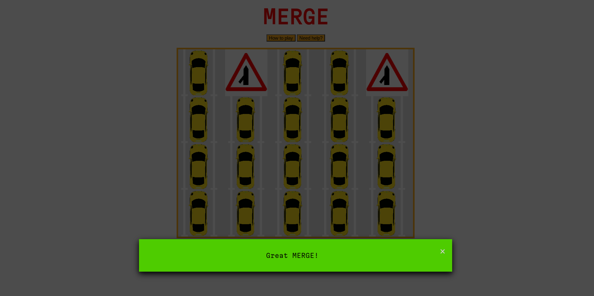

### Tablet

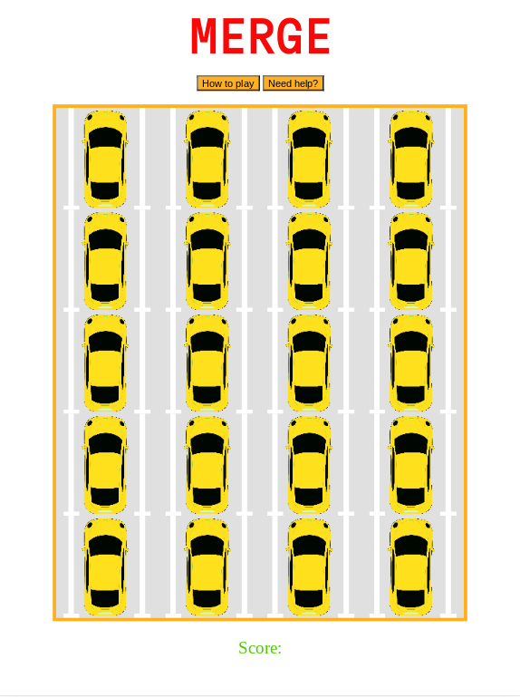
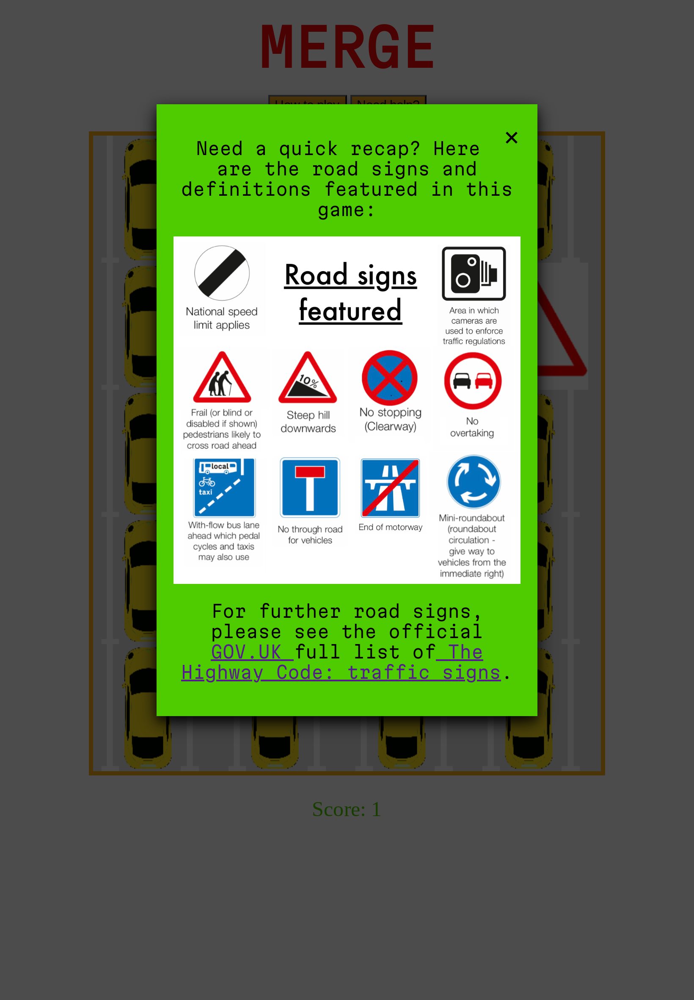

### Mobile

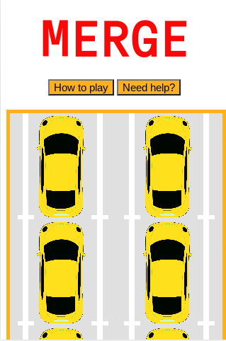
(iPhone 4)
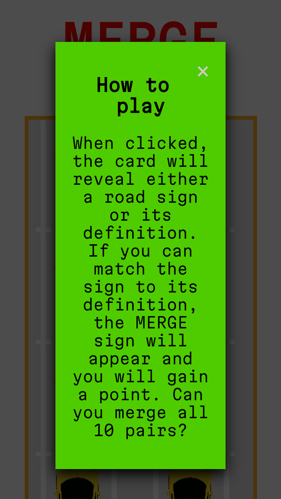
(iPhone SE)

MERGE fulfills the acceptance criteria: *The game should have multiple cards which turn over when clicked to reveal road signs or definitions. Players should be able to click on two cards and the computer should reveal whether or not they are a match.*

## Testing

Testing user goals:

*As a UK learner driver:*

*1. I want to understand the meaning of UK road signs*
The user is able to learn the road signs effectively, through matching the signs to its defintion. The user may decide to refresh the game and the cards will be randomised, allowing the user to play over and over until they have understood. If the user requires additional road signs, a link is provided to further signs in the 'Need help?' modal. The modal also includes a quick recap of the road signs featured in the game to ensure the user is continuously learning and understanding the meaning of UK road signs.

*2. I want to have fun while learning*
By educating through the matching memory game, MERGE allows an addictive and interactive sense of fun for the learner driver. As a [significant](https://www.gov.uk/government/statistics/driver-and-rider-testing-and-instructor-statistics-april-2022-to-march-2023/driver-and-rider-testing-and-instructor-statistics-april-2022-to-march-2023#cars-by-age-gender-and-number-of-attempts) portion of learner drivers are young people, and [Statistica](https://www.statista.com/statistics/300513/gaming-by-demographic-group-uk/) claims that 88% of people aged 16-24 played video games in 2022, gaming is a useful tool to educate learner drivers. Furthermore, the game is fun through its use of traffic light colours and the cars (cards) being parked in a car park. It is visually stimulating for users to want to keep learning/playing.

*3. I want to play a road sign game without being distracted*
While the game is fun, the minimalistic structure to the game allows the user to play continuously without being distracted by unnecessary colour or any visual elements that don't relate to the game itself. Initially the page included the MERGE sign as a logo in the corner of the page, however, it was removed as it was not only reundant to the user, but also distracting, especially on smaller devices.

*4. I want to be referred to further road signs to take my knowledge further*
The user is referred to further road signs within the "Need help?" modal button. This provides a link to the GOV.UK traffic signs page and it provides a link to a PDF including all traffic signs. These links open in separate tabs to the game itself, in order to ensure the user is not distracted and can play the game/learn efficiently.

Using [Google's Dev Tools](https://developer.chrome.com/docs/devtools/), MERGE has been tested on the following devices for responsivity: desktop, iPhone (4, SE, XR, 12 Pro), Pixel 5, Samsung Galaxy (S8+, S20 Ultra, and A51/71), iPad (Air and Mini), Surface (Pro 7, Duo), Galaxy Fold, and Nest Hub. The page has also been manually tested on the following devices: iPhone 11, iPad, and Chromebook.

While testing, an issue preesented itself in which the responsiveness of the site was quite inconsistent. The site would present itself correctly initially, with the widths all being smaller than its respective screen sizes due to breakpoints. However, after testing on different devices on Dev Tools, the site would become unresponsive. The site appeared to be attempting to ensure the title and buttons remain centered, causing the game area to be pulled off the screen. After numerous attempts of solving this issue and visiting and revisiting the game area's breakpoints, Sean from tutor assistance was able to help resolve the issue. The issue was that I had used flexbox for my game area as opposed to css grid which could handle the breakpoints more effectively. With Sean's assistance, the page is now fully responsive.

Initially, MERGE scored merely 77% on [Google Lighthouse](https://chrome.google.com/webstore/detail/lighthouse/blipmdconlkpinefehnmjammfjpmpbjk)'s Accessibility test due to a lack of alt tags for images within the javascript file. This issue has now been rectified and here are the current scores:
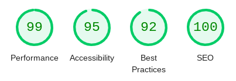

### Validator Testing

- [JSHint](https://jshint.com/) has been used to test thoughout this project. Initially, there were lots of small errors, e.g. no semi-colon, which were easy to fix. There are no errors on JSHint.
- [W3C HTML](https://validator.w3.org/nu/?doc=https%3A%2F%2Fmipear.github.io%2FMerge%2F) found 10 errors initially, all showing "Info: Trailing slash on void elements has no effect and interacts badly with unquoted attribute values". There are no errors on W3C HTML. 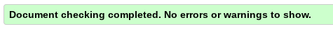
- [W3C CSS Validator](https://jigsaw.w3.org/css-validator/validator?uri=https%3A%2F%2Fmipear.github.io%2FMerge%2F&profile=css3svg&usermedium=all&warning=1&vextwarning=&lang=en) found no errors. 

### Unfixed Bugs

There are no known bugs on MERGE.

## Deployment

The game was deployed to GitHub pages. The steps to deploy are as follows:

- Open file repository on github as found [here](https://github.com/mipear/Merge)
- Click “Settings” on the right of the top nav bar
- Click on “Pages” under the “Code and automation” menu
- Under the “Build and deployment” section, switch the Branch from “None” to “Main” and Save
- The live link can be found here: [Live link](https://mipear.github.io/Merge/)
- If you wish the customise the domain for the site, you can do so by typing and saving your new domain under the “Custom domain” section beneath “Build and deployment”.

## Credits

Thank you to Martina and Iris for their support in creating this game. Thank you also to my brother, Joe, for his support and the team at tutor assistance, especially Sean who helped with responsiveness.

### Content

The following tutorials/resources were useful in understanding how to create a memory card game:

- Code Institute course tutorials, namely, the [Love Maths Tutorial](https://learn.codeinstitute.net/courses/course-v1:CodeInstitute+CPJS_06_20+2020_T1/courseware/8f9b28d4b7664bb59ddf18b8e090671f/87791688b88e46099e3a77f455419aa8/)
- [Make MEMORY GAME](https://www.youtube.com/watch?v=tjyDOHzKN0w&ab_channel=CodewithAniaKub%C3%B3w)
- [Create a Modal With HTML, CSS & JavaScript](https://www.youtube.com/watch?v=6ophW7Ask_0&ab_channel=TraversyMedia)
- [Google Fonts](https://fonts.google.com/)' Martian Mono, monospace was used for the title and text of the game.
- I used [Coolors](https://coolors.co/palette/fa0707-ffa600-52d600-ffffff-e2e2e2) to generate the colour palette.
- [Favicon](https://favicon.io/favicon-converter/) was used to create the game's Favicon
- In order to assist in creating this README.md, I used [this](https://github.com/Code-Institute-Solutions/readme-template) template.

### Frameworks and other resources

- [User Stories Guide](https://github.com/awkale/user-story-best-practice/blob/master/README.md)
- [Am I responsive?](https://ui.dev/amiresponsive?url=https://mipear.github.io/Merge/) was used to create the mockup.
- [Balsamiq](https://balsamiq.com/wireframes/desktop/#) was used to create wireframes.
- [Github](https://github.com/)
- [CodeAnywhere](https://app.codeanywhere.com/)
- [Google's Dev Tools](https://developer.chrome.com/docs/devtools/) for testing
- [JSHint](https://jshint.com/)
- [W3C CSS Validator](https://jigsaw.w3.org/css-validator/validator?uri=https%3A%2F%2Fmipear.github.io%2FMerge%2F&profile=css3svg&usermedium=all&warning=1&vextwarning=&lang=en)
- [W3C HTML](https://validator.w3.org/nu/?doc=https%3A%2F%2Fmipear.github.io%2FMerge%2F)

### Media

- The traffic signs and their definitions were taken from [Gov.uk's Highway Code Traffic Signs](https://assets.publishing.service.gov.uk/media/58170307ed915d61c5000000/the-highway-code-traffic-signs.pdf) / [Gov.uk](https://www.gov.uk/guidance/the-highway-code/traffic-signs)
- [Procreate](https://procreate.com/) was used to create the card images.
